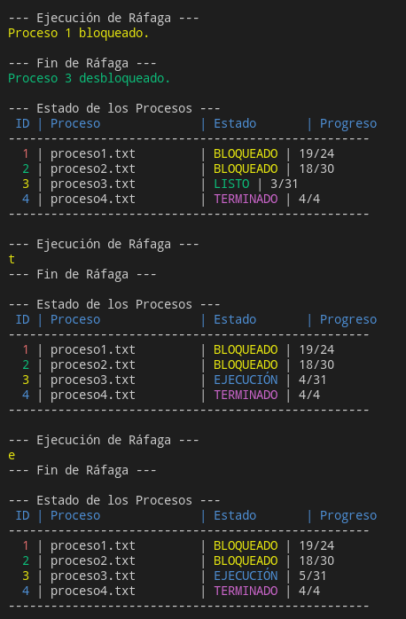

# El Planificador de Procesos (Process Scheduler)

## ¿Qué es el Planificador de Procesos?

En un sistema operativo multitarea, donde múltiples procesos compiten por los recursos del sistema (principalmente la Unidad Central de Procesamiento o CPU), el **planificador de procesos** (o *scheduler*) es el componente fundamental encargado de decidir qué proceso se ejecutará en la CPU en un momento dado. Su objetivo principal es optimizar el uso de la CPU, maximizar el rendimiento del sistema y proporcionar una experiencia de usuario fluida y eficiente.

El planificador de procesos gestiona las transiciones de los procesos entre diferentes estados, como:

* **Nuevo:** El proceso se está creando.
* **Listo:** El proceso está en memoria principal y listo para ser ejecutado por la CPU.
* **En Ejecución:** El proceso está actualmente utilizando la CPU.
* **Bloqueado (o En Espera):** El proceso está esperando algún evento externo para continuar (por ejemplo, la finalización de una operación de E/S, la liberación de un recurso).
* **Terminado:** El proceso ha completado su ejecución.

## ¿Para qué sirve el Planificador de Procesos?

El planificador de procesos desempeña un papel crucial en el funcionamiento de un sistema operativo multitarea, buscando alcanzar los siguientes objetivos:

* **Maximizar el rendimiento de la CPU (Throughput):** Ejecutar la mayor cantidad de trabajo posible en un intervalo de tiempo dado.
* **Minimizar el tiempo de respuesta (Response Time):** Reducir el tiempo que transcurre desde que se realiza una solicitud hasta que se produce la primera respuesta. Esto es especialmente importante para sistemas interactivos.
* **Minimizar el tiempo de espera (Waiting Time):** Reducir el tiempo total que un proceso pasa en la cola de listos esperando para ser ejecutado.
* **Garantizar la equidad (Fairness):** Asegurar que cada proceso reciba una porción justa del tiempo de CPU, evitando la inanición (starvation) de procesos.
* **Optimizar el uso de los recursos:** Equilibrar el uso de la CPU con otros recursos del sistema, como la memoria y los dispositivos de E/S.
* **Priorizar procesos (en sistemas con prioridades):** Permitir que procesos más importantes o urgentes se ejecuten antes que otros.

## Simulador de Planificador de Procesos en C++

Este documento presenta un simulador básico de un planificador de procesos implementado en C++ utilizando programación orientada a objetos. El simulador permite cargar procesos desde archivos, simular sus estados (en espera, bloqueado, en ejecución, terminado) y visualizarlos en la terminal con colores para diferenciarlos.

### Cómo Funciona el Simulador

1.  **Carga de Procesos:** El simulador puede cargar múltiples procesos. Cada proceso se define mediante un archivo de texto cuyo contenido representa las "instrucciones" que el proceso debe ejecutar (en este caso, simplemente se muestran carácter por carácter).

2.  **Estados de los Procesos:** Cada proceso pasa por diferentes estados durante su ciclo de vida, simulados por el planificador:
    * **NUEVO:** Cuando el proceso es cargado inicialmente.
    * **LISTO:** Cuando el proceso está en memoria y esperando su turno para usar la CPU.
    * **EJECUCIÓN:** Cuando el planificador le asigna la CPU y sus caracteres se muestran en pantalla.
    * **BLOQUEADO:** Durante la ejecución, se simula un evento aleatorio que puede bloquear el proceso, simulando una espera por un recurso o evento externo.
    * **TERMINADO:** Cuando todos los caracteres del archivo del proceso han sido mostrados.

3.  **Planificación (Round Robin Básico):** El simulador implementa una forma sencilla de planificación Round Robin. En cada "ciclo" de planificación:
    * Los procesos en estado `LISTO` pasan a `EJECUCIÓN` (en este modelo simplificado, todos los listos intentan ejecutarse en el mismo ciclo).
    * Los procesos en `EJECUCIÓN` muestran un carácter de su contenido. Se simula una pequeña probabilidad de que un proceso en ejecución se bloquee.
    * Los procesos en `BLOQUEADO` tienen una pequeña probabilidad de pasar a `LISTO` (desbloquearse).

4.  **Visualización con Colores:** Para mejorar la legibilidad, el simulador utiliza códigos de escape ANSI para mostrar los diferentes estados de los procesos y la salida de cada proceso con colores distintos.
    * **NUEVO:** Cyan
    * **LISTO:** Verde
    * **EJECUCIÓN:** Azul
    * **BLOQUEADO:** Amarillo
    * **TERMINADO:** Magenta
    * **Salida de cada proceso:** Un color único asignado al proceso (rojo, verde, amarillo, azul, magenta, etc.).

5.  **Tabla de Estado:** En cada ciclo de simulación, se muestra una tabla en la terminal que indica el estado actual de cada proceso, incluyendo su ID (con el color del proceso), el nombre del archivo asociado (como "Proceso"), su estado actual y su progreso de "ejecución".



### Explicación del Código C++

```cpp
#include <iostream>
#include <fstream>
#include <vector>
#include <string>
#include <sstream>
#include <chrono>
#include <thread>
#include <cstdlib> // Para system("color ..."); en Windows
#include <iomanip> // Para std::setw

// Definiciones de colores ANSI para la terminal
#define COLOR_RESET   "\033[0m"
#define COLOR_RED     "\033[31m"
#define COLOR_GREEN   "\033[32m"
#define COLOR_YELLOW  "\033[33m"
#define COLOR_BLUE    "\033[34m"
#define COLOR_MAGENTA "\033[35m"
#define COLOR_CYAN    "\033[36m"
#define COLOR_GRAY    "\033[90m"

// Definición de los estados del proceso
enum class EstadoProceso {
    NUEVO,
    LISTO,
    EJECUCION,
    BLOQUEADO,
    TERMINADO
};

// Función para convertir el estado del proceso a una cadena con color
std::string estadoAStringConColor(EstadoProceso estado) {
    switch (estado) {
        case EstadoProceso::NUEVO:
            return COLOR_CYAN "NUEVO" COLOR_RESET;
        case EstadoProceso::LISTO:
            return COLOR_GREEN "LISTO" COLOR_RESET;
        case EstadoProceso::EJECUCION:
            return COLOR_BLUE "EJECUCIÓN" COLOR_RESET;
        case EstadoProceso::BLOQUEADO:
            return COLOR_YELLOW "BLOQUEADO" COLOR_RESET;
        case EstadoProceso::TERMINADO:
            return COLOR_MAGENTA "TERMINADO" COLOR_RESET;
        default:
            return "DESCONOCIDO";
    }
}

// Clase que representa un proceso
class Proceso {
public:
    int id;
    std::string nombreArchivo;
    std::string contenido;
    EstadoProceso estado;
    size_t progreso;
    std::string colorProceso; // Color único para la salida del proceso

    Proceso(int id, const std::string& nombreArchivo, const std::string& color) :
        id(id), nombreArchivo(nombreArchivo), estado(EstadoProceso::NUEVO), progreso(0), colorProceso(color) {}

    bool cargarContenido() {
        std::ifstream archivo(nombreArchivo);
        if (archivo.is_open()) {
            std::stringstream buffer;
            buffer << archivo.rdbuf();
            contenido = buffer.str();
            archivo.close();
            estado = EstadoProceso::LISTO;
            return true;
        } else {
            std::cerr << COLOR_RED "Error al abrir el archivo: " << nombreArchivo << COLOR_RESET << std::endl;
            estado = EstadoProceso::TERMINADO;
            return false;
        }
    }

    bool ejecutarCaracter() {
        if (estado == EstadoProceso::EJECUCION && progreso < contenido.length()) {
            std::cout << colorProceso << contenido[progreso] << COLOR_RESET;
            progreso++;
            std::this_thread::sleep_for(std::chrono::milliseconds(100));
            if (progreso == contenido.length()) {
                estado = EstadoProceso::TERMINADO;
                std::cout << COLOR_MAGENTA " (Proceso " << id << " Terminado)" COLOR_RESET << std::endl;
            }
            return true;
        }
        return false;
    }

    void bloquear() {
        if (estado == EstadoProceso::EJECUCION) {
            estado = EstadoProceso::BLOQUEADO;
            std::cout << COLOR_YELLOW "Proceso " << id << " bloqueado." COLOR_RESET << std::endl;
        }
    }

    void desbloquear() {
        if (estado == EstadoProceso::BLOQUEADO) {
            estado = EstadoProceso::LISTO;
            std::cout << COLOR_GREEN "Proceso " << id << " desbloqueado." COLOR_RESET << std::endl;
        }
    }

    void mostrarInfo() const {
        std::cout << colorProceso << std::setw(3) << id << COLOR_RESET << " | "
                  << std::left << std::setw(20) << nombreArchivo << std::right << " | "
                  << std::left << std::setw(12) << estadoAStringConColor(estado) << std::right << " | "
                  << progreso << "/" << contenido.length() << std::endl;
    }
};

// Clase que simula el planificador de procesos
class Planificador {
public:
    std::vector<Proceso> procesos;
    int siguienteId = 1;
    std::vector<std::string> coloresProceso = {COLOR_RED, COLOR_GREEN, COLOR_YELLOW, COLOR_BLUE, COLOR_MAGENTA};
    int siguienteColor = 0;

    void agregarProceso(const std::string& nombreArchivo) {
        std::string color = coloresProceso[siguienteColor % coloresProceso.size()];
        Proceso nuevoProceso(siguienteId++, nombreArchivo, color);
        siguienteColor++;
        if (nuevoProceso.cargarContenido()) {
            procesos.push_back(nuevoProceso);
            std::cout << COLOR_GREEN "Proceso " << nuevoProceso.id << " cargado desde " << nombreArchivo << COLOR_RESET << std::endl;
        }
    }

    void simularCiclo() {
        if (procesos.empty()) {
            std::cout << "No hay procesos para ejecutar." << std::endl;
            return;
        }

        // Fase de transición a EJECUCION
        for (auto& proceso : procesos) {
            if (proceso.estado == EstadoProceso::LISTO && proceso.estado != EstadoProceso::EJECUCION) {
                proceso.estado = EstadoProceso::EJECUCION;
            }
        }

        std::cout << "\n--- Ejecución de Ráfaga ---" << std::endl;
        for (auto& proceso : procesos) {
            if (proceso.estado == EstadoProceso::EJECUCION) {
                // Simular un evento aleatorio de bloqueo (15% de probabilidad)
                if (rand() % 7 == 0) {
                    proceso.bloquear();
                } else {
                    proceso.ejecutarCaracter();
                }
            }
        }
        std::cout << "\n--- Fin de Ráfaga ---" << std::endl;

        // Fase de desbloqueo aleatorio (10% de probabilidad para cada proceso bloqueado)
        for (auto& proceso : procesos) {
            if (proceso.estado == EstadoProceso::BLOQUEADO && rand() % 10 == 0) {
                proceso.desbloquear();
            }
        }
    }

    void mostrarEstadoProcesos() const {
        std::cout << "\n--- Estado de los Procesos ---" << std::endl;
        std::cout << COLOR_BLUE << std::setw(3) << "ID" << " | "
                  << std::left << std::setw(20) << "Proceso" << std::right << " | "
                  << std::left << std::setw(12) << "Estado" << std::right << " | "
                  << "Progreso" << COLOR_RESET << std::endl;
        std::cout << "---------------------------------------------------" << std::endl;
        for (const auto& proceso : procesos) {
            std::cout << proceso.colorProceso << std::setw(3) << proceso.id << COLOR_RESET << " | "
                      << std::left << std::setw(20) << proceso.nombreArchivo << std::right << " | "
                      << std::left << std::setw(12) << estadoAStringConColor(proceso.estado) << std::right << " | "
                      << proceso.progreso << "/" << proceso.contenido.length() << std::endl;
        }
        std::cout << "---------------------------------------------------" << std::endl;
    }

    bool todosTerminados() const {
        for (const auto& proceso : procesos) {
            if (proceso.estado != EstadoProceso::TERMINADO) {
                return false;
            }
        }
        return true;
    }
};

int main() {
#ifdef _WIN32
    system("color");
#endif

    Planificador planificador;
    srand(time(nullptr));

    planificador.agregarProceso("proceso1.txt");
    planificador.agregarProceso("proceso2.txt");
    planificador.agregarProceso("proceso3.txt");
    planificador.agregarProceso("proceso4.txt");
    planificador.agregarProceso("un_proceso_con_nombre_largo.txt"); // Ejemplo de nombre largo

    std::cout << "\n--- Simulación del Planificador ---" << std::endl;

    while (!planificador.todosTerminados()) {
        planificador.simularCiclo();
        planificador.mostrarEstadoProcesos();
        std::this_thread::sleep_for(std::chrono::milliseconds(800));
    }

    std::cout << "\n--- Todos los procesos han terminado. ---" << std::endl;

    return 0;
}

// Contenido de ejemplo para los archivos (puedes crear más):
// proceso1.txt: Texto del primer proceso.
// proceso2.txt: Contenido del segundo trabajo.
// proceso3.txt: Un tercer proceso en marcha.
// proceso4.txt: Este es el cuarto proceso.
// un_proceso_con_nombre_largo.txt: Este proceso tiene un nombre de archivo extenso.
```
